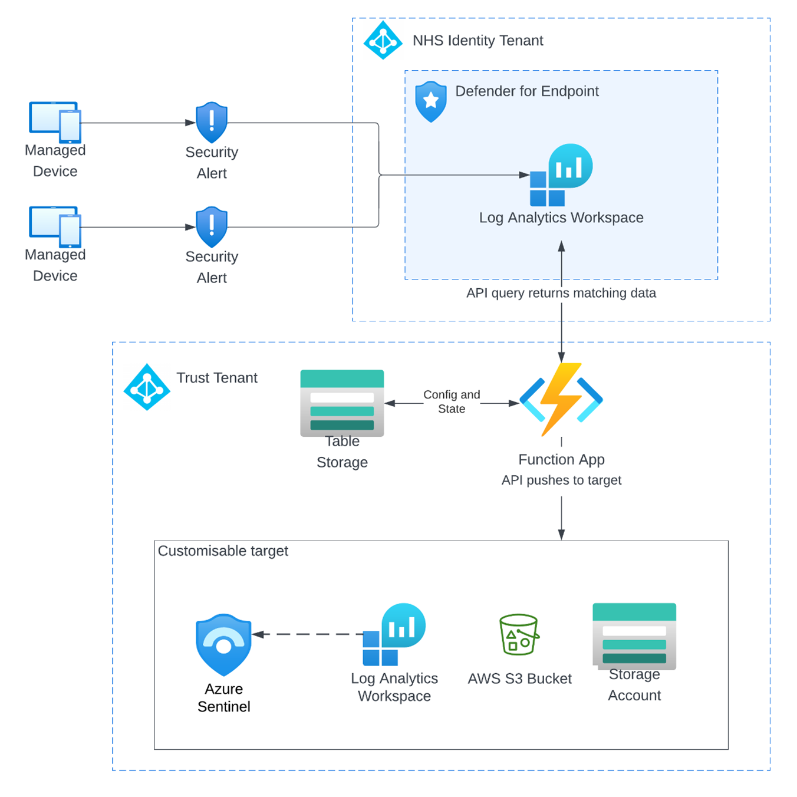
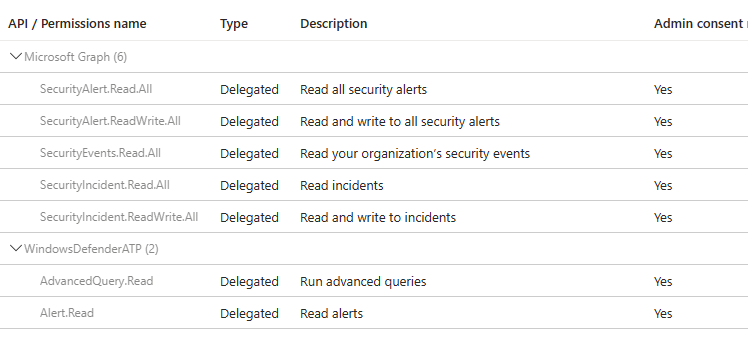
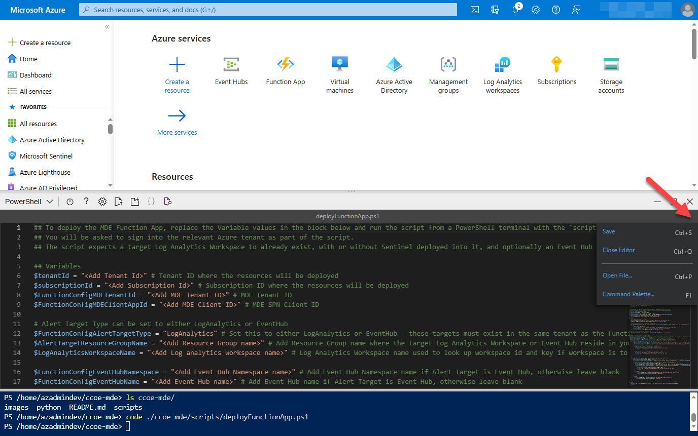
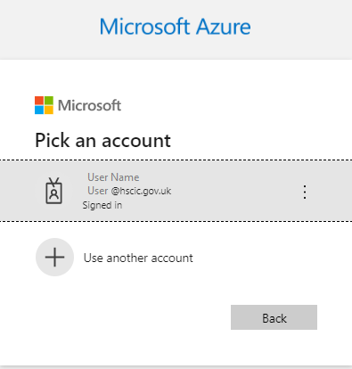
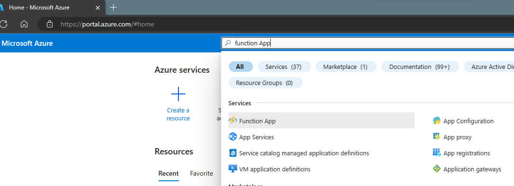
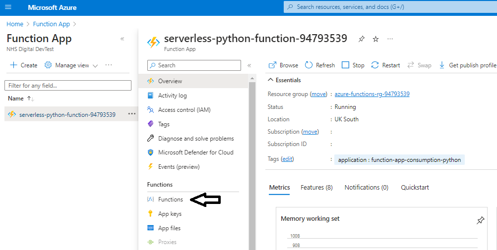
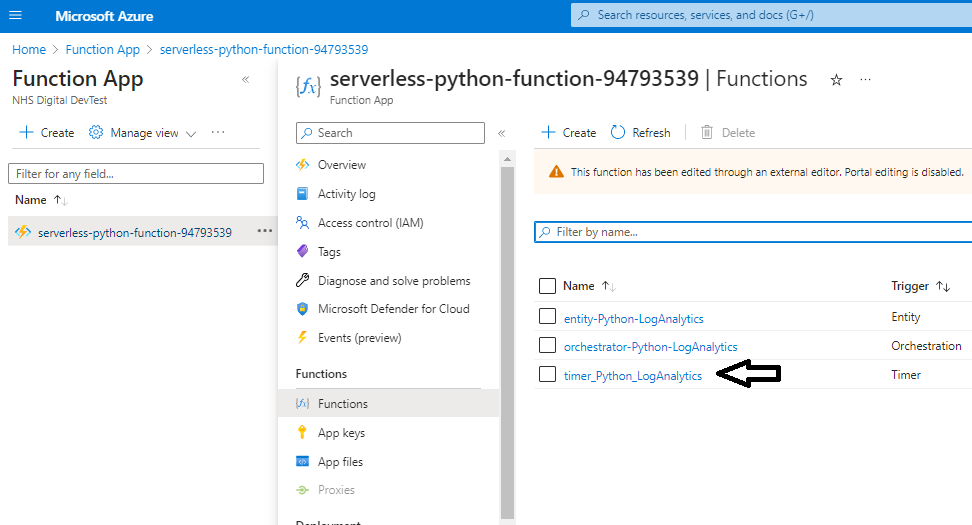
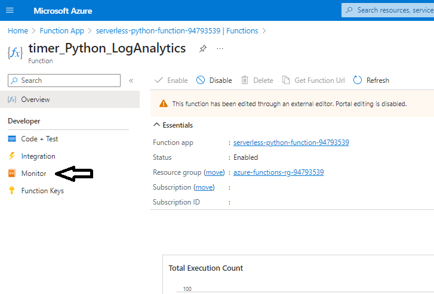
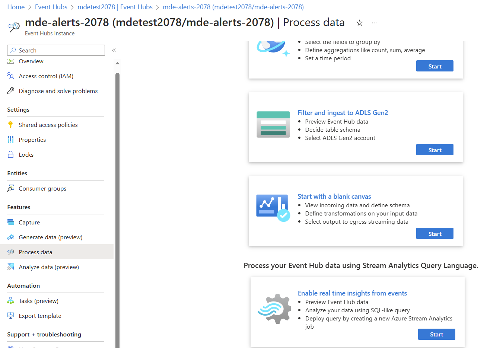
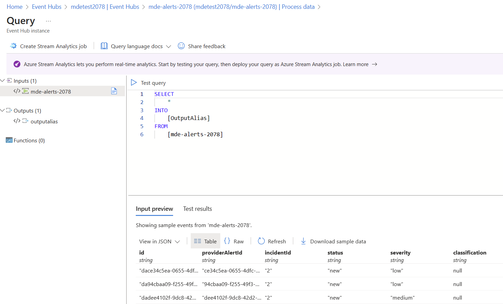

# Azure Function App Proof of Concept

## Overview of Solution

CCoE was asked to provide a solution that could be run in an Azure Function App to call the MDE Graph APIs to extract alert data from the central tenant, while meeting the data scoping requirement via an App Registration service principal with (user) Delegated Permissions.

With this access model, the service principal provides initial authorisation to access the APIs, but RBAC level control over data access is determined by the credentials of the user who actually authenticates the OAuth credential flow used by the API calls.

This results in a fairly simple architectural model being required and has the additional advantage that the majority of the resources involved are owned and managed by the external organisation, reducing the management and cost burden on the CSOC team.

## Table of Contents

- [Introduction](#introduction)
- [High Level Design](#high-level-design)
  - [Identity Tenant Resources](#identity-tenant-resources)
  - [Trust Tenant](#trust-tenant)
    - [Storage Account Table](#storage-account-table)
    - [App Service Plan](#app-service-plan)
    - [Function App](#function-app)
    - [App Settings](#app-settings)
    - [Log Analytics Workspace](#log-analytics-workspace)
    - [Event Hub](#event-hub)
- [Deployment Guidelines](#deployment-guidelines)
  - [Prerequisites](#prerequisites)
  - [Deploy Code](#deploy-code)
  - [Installation Steps](#installation-steps)
- [Azure Function App Authentication](#azure-function-app-authentication)
- [Deployment Checklist](#deployment-checklist)
- [Future Roadmap](#future-roadmap)
- [Glossary of Terms](#glossary-of-terms)
- [Resources](#resources)

## Introduction

A centralised identity management team within NHSE CSOC is responsible for managing the Active Directory that devices across many distributed NHS organisations (e.g., Trusts) use to authenticate users and register end-user devices against.

Microsoft Defender for Endpoint (MDE) is enabled within the synchronised Azure Active Directory (AAD) tenant to detect security events originating within these devices.

The CCoE was asked to assist the security team in creating a process to allow the distributed organisations to extract Microsoft Defender for Endpoint Alerts from the central Identity Tenant into their own SIEM tooling.

The devices are segregated by organisation within MDE by the use of Device Groups, and a core tenant of the final solution was that the extracts MUST be scoped to just the alerts from devices in a specific group (i.e., the devices managed by the organisation querying the data), with no risk of data from the other organisations also being accessible.

## High Level Design

The solution is designed to export MDE Alerts from one tenant and push them to another. For simplicity’s sake these are referred to as the “Identity Tenant”, where MDE exists, and the “Trust Tenant”, where the Function App exists and probably, but not necessarily, where alerts will be pushed to.



### Identity Tenant Resources

On the assumption that the Identity Tenant already exists and that MDE is deployed into it with devices grouped by appropriate end-user Device Groups, very minimal change is required in the tenant to deploy this solution.
In fact, the only resource required is an App Registration service principal with relevant API permissions assigned to it:



## Trust Tenant

The bulk of the solution exists within the Trust Tenant and is comprised of the following resources, most of which are automatically created as part of the deployment process defined below.

### Storage Account Table

Required internally by the Function App to store session state information and also used to store the last successful query time.

### App Service Plan

Consumption plan is sufficient but does not allow creation of private endpoints, which means that public networking must be used to connect to the storage account.

As neither of the function app and the storage account contain sensitive data this does not introduce significant security risks, but it is recommended that a paid-for service plan is used so that private endpoints can be implemented if possible.

Having said this, the solution was developed and tested using a Linux Y1 consumption-based plan.

### Function App

The main functionality of the solution is provided by a Python 3.9 function with three component parts:

- `entity-Python-LogAnalytics`: manages entity state to provide stateful sessions to the timer function
- `orchestrator-Python-LogAnalytics`: orchestrates the workflow between the entity and timer functions
- `timer-Python-LogAnalytics`: contains the main function code that runs on a scheduled basis to perform the alert extracts.

> :heavy_exclamation_mark: Note that the function app and storage account do not contain sensitive data, so public networking is not a significant security risk. However, it is recommended to use a paid service plan to implement private endpoints if possible.

### App Settings

A number of App Settings are used in the function app to store run-time variables, such as tenant and client Ids, the storage account name etc.

### Log Analytics Workspace

Used to store the alerts extracted from MDE, unless an Event Hub is specified instead. Also used to capture Heartbeat messages from the function app, unless this option is turned off in the [App Settings](#app-settings).

This Workspace must be created in advance of running the deployment and can be a pre-existing workspace.

### Event Hub

Used optionally to stream the Alerts to instead of sending them to a Log Analytics Workspace. If this option is selected then the Event Hub must be created in advance of running the deployment and can be a pre-existing Event Hub.

## Deployment Guidelines

### Prerequisites

1. Register **Microsoft.Web** resource provider, see: [Register resource provider](https://learn.microsoft.com/en-us/azure/azure-resource-manager/management/resource-providers-and-types#azure-portal)

> :heavy_exclamation_mark: Note: It may be necessary to wait between 20 minutes and 12 hours for the registration to complete. See linked documentation for how to review this progress.

2. Azure User with Owner or Contributor right to the subscription that the Function App will be deployed into.

### Deploy Code

The deployment can be built using a PowerShell script available in this repo.
The following variables relating to the Identity and Trust tenant environments need to be set in the PowerShell code:

| Variable name | Description                           |
|---------------------|-----------------------------------------------|
|$tenantId | Add the Tenant ID where the resources will be deployed|
|$subscriptionId | Add the Subscription ID where the resources will be deployed|
|$FunctionConfigMDETenantId |Add Central MDE Tenant ID|
|$FunctionConfigMDEClientAppId | Add Central MDE Client ID |
|$FunctionConfigAlertTargetType | Set this to either LogAnalytics or EventHub |
|$LogAnalyticsResourceGroupName| Resource Group name where the target Log Analytics Workspace resides in your local tenant|
|$LogAnalyticsWorkspaceName | Log Analytics Workspace name used to look up workspace id and key if workspace is to be used as the alert target or for sending Heartbeat events to|
|$EventHubResourceGroupName | Resource Group name where the target Event Hub resides in your local tenant|
|$FunctionConfigEventHubNamespace | Event Hub Namespace name if Event Hub is to be used as the alert target, otherwise blank|
|$FunctionConfigEventHubName | Event Hub name if Event Hub is to be used as the alert target, otherwise blank|
|FunctionConfigEventHubAccessKeyName | Event Hub Access Key Name - can be namespace root or hub-specific - key will be looked up by the script|
|$randomIdentifier | Random number appended to resources created by this script to provide uniqueness|
|$location | "uksouth"|
|$functionAppResourceGroup | "azure-functions-rg-$randomIdentifier" - modify as required|
|$tag | @{application  "function-app-consumption-python" } - modify as required|
|$storage | "funcappsaccount$randomIdentifier" - modify as required|
|$functionApp | "serverless-python-function-$randomIdentifier" - modify as required|
|$skuStorage | "Standard_LRS"|
|$functionsVersion | "4"|
|$pythonVersion | "3.9" #Allowed values: 3.7, 3.8, and 3.9|
|$FunctionConfigSendHeartbeatToLogAnalytics | True or False, default is True|
|$FunctionConfigUse_last_saved_time | True or False, default is True|
|$FunctionConfigLogAnalyticsTableName | "DefenderRawAlert"|
|$FunctionConfigStorageTable | "fnautomationmdeCachedValues"|
|$FunctionConfigStorageContainer | "functionlogging"|
|$FunctionConfigLoggingLevel | "3" # Set this to value in range 1-5 where 1 logs everything and 5 logs only most significant output|
|$filepath| "Python-Functions.zip"|

### Installation Steps

1. While the installation can be carried out from a PowerShell session in a local workstation, it is recommended to use Azure Cloud Shell, which is available from the Azure Portal. This provides a Linux-based environment with all the tools required to run the installation script and avoids security issues that can occur when running locally.

2. To access the cloud shell, click on the icon in the top-right corner of the Azure Portal and then select **PowerShell**:


3. Create a suitable working directory and navigate to it. This can be done in Cloud Shell by entering the following command:

```shell
mkdir ccoe-mde
cd ccoe-mde
```

4. Clone the repo to your local machine or, preferably, Azure Cloud Shell by running the following command:

```shell
git clone https://github.com/NHSDigital/ccoe-mde.git
```

Note: to paste into the Cloud Shell from a Windows computer, click **Ctrl+Shift+V**.

5. Navigate to the **scripts** folder inside the cloned repo:
  
  ```shell
  cd ./ccoe-mde/scripts
  ```

6. Edit the denoted variables in the file **deployFunctionApp.ps1** located inside the scripts folder, using your preferred text editor, according to your local Azure environment. In Cloud Shell this can be done by entering the following command:

```shell
code ./deployFunctionApp.ps1
```

To Save and Exit the file in Cloud Shell, press **Ctrl+S** and then **Ctrl+Q**, or hover the mouse pointer in the top-right corner of the Cloud Shell window and click on the required menu options.



7. Once edited, navigate to the **scripts** folder inside the cloned repo and Run the script:

```shell
  .\deployFunctionApp.ps1
```

8. You will be asked if you want to refresh your Azure login - click **No** if running in the Cloud Shell, and click **Yes** or **No** as required if running locally.


9. If you click Yes, a browser window will pop up requesting authentication into the Azure Portal to start the deployment of the required resources.



10. Wait for the deployment process to complete.


> :heavy_exclamation_mark: Note if the following error is displayed, it is most likely that the version of the Az.Websites PowerShell module is not compatible with the version of PowerShell being used. 


To resolve this, run the following command in the Cloud Shell to install a known good version of the module, and then run the script again:

```shell
    Remove-Module -Name Az.Websites -ErrorAction SilentlyContinue
    Install-Module -Name Az.Websites -RequiredVersion 2.15.0 -Force -ErrorAction SilentlyContinue
    Import-module -Name Az.Websites -RequiredVersion 2.15.0 -Force
```

These changes only affect the current session so do not need to be reverted after the script has run.

## Azure Function App Authentication

1. Go to the *Azure* portal and search for Function App, click on the function that just deployed (serverless-python-function-xxxxxxxxx).



2. In the Function App's overview page, click on the **Functions** in the Functions section on the left-hand side.



3. Select the Timer function named **"timer_Python_LogAnalytics"** (Note: It can take up to a minute after running the deployment script for the functions to appear in this screen).



4. Click on the **Monitor** in the Developer section.



5. Click on **Logs** and wait for the logs to update (it might take a few minutes).


6. To authenticate the Azure Function, click on the following URL <https://microsoft.com/devicelogin> add the code shown in the **logs** and log in using a user credential that has RBAC permission in the MDE environment.


7. Once authenticated, the Azure Function will start to send logging information to the Monitor page on every 5 minute mark, and also send corresponding Heartbeat events to the Log Analytics Workspace unless this option is turned off in the App Configuration Settings.

## Streaming to Event Hub

By default the deployment script detailed above is configured to send the Defender for Endpoint alerts to a Log Analytics Workspace. However, it is also possible to stream them to an Event Hub.

To enable this, the following steps are required:

1. Create an Event Hub Namespace in the Azure Portal.

2. Create an Event Hub in the Event Hub Namespace.

3. Create a Shared Access Policy in the Event Hub Namespace, or the Event Hub itself, with **Send** permissions.


4. Add the following details to the deployment script variables:

| Variable Name | Value |
|---------------|-------|
| EventHubNamespace | The name of the Event Hub Namespace |
| EventHubName | The name of the Event Hub |
| EventHubAccessKeyName | The name of the Shared Access Policy |

Once the Function App is deployed and running, it is possible to monitor the data received by the Event Hub as follows:

1. In the Azure Portal, navigate to the Event Hub Namespace and select the Event Hub.

2. Click on **Process Data** in the **Overview** section and select the Process your Event Hub data using Stream Analytics Query Language:



3. Accept the default query and click Run:



## Deployment Checklist

| Task                                                                                   | Completed |
|----------------------------------------------------------------------------------------|-----------|
| Register **Microsoft.Web** resource provider.                                              | <a href="#" onclick="toggleCheckbox('task1');return false;"><input type="checkbox" id="task1" name="task1" value="value1"></a> |
| Ensure Azure User has **Contributor** or **Owner** rights to subscription.                     | <a href="#" onclick="toggleCheckbox('task2');return false;"><input type="checkbox" id="task2" name="task2" value="value2"></a> |
| Clone the repo.                                                                         | <a href="#" onclick="toggleCheckbox('task3');return false;"><input type="checkbox" id="task3" name="task3" value="value3"></a> |
| Edit the variables Tenant ID, Subscription ID, MDE Tenant ID, MDE Client ID, Log Analytics workspace name, and Log Analytics Resource Group name. | <a href="#" onclick="toggleCheckbox('task4');return false;"><input type="checkbox" id="task4" name="task4" value="value4"></a> |
| Authenticate the Azure Function using the device code shown on the function app logs. | <a href="#" onclick="toggleCheckbox('task5');return false;"><input type="checkbox" id="task5" name="task5" value="value5"></a> |
| After 30 minutes check if the new tables **DefenderRawAlert_CL** and **Heartbeat_CL** were created in the specified Log Analytics Workspace. | <a href="#" onclick="toggleCheckbox('task6');return false;"><input type="checkbox" id="task6" name="task6" value="value6"></a> |

## Future Roadmap

- Amend Deployment Script to allow Python code to be redeployed into existing Function App.

- Create Action Group to alert when Heartbeat is not received.

- Create Sentinel Alert Rules that convert raw alert data into Sentinel Alerts to the deployment  script.

- Use Managed Identity to access Storage Account.

- Add alternative Alert output formats and locations (e.g. Storage Account, Event Hub, AWS S3 bucket etc).

## Glossary of Terms

| Term / Abbreviation | What it stands for                            |
|---------------------|-----------------------------------------------|
| API                 | Application Programming Interface             |
| CASB                | Cloud Access Security Broker                  |
| CSOC                | Cyber Security Operations Centre              |
| CSPM                | Cloud Security Posture Management             |
| CWPP                | Cloud Workload Protection Platform            |
| EDR                 | Endpoint Detection and Response               |
| MDC                 | Microsoft Defender for Cloud                  |
| MDE                 | Microsoft Defender for Endpoint               |
| SIEM                | Security Information and Event Management     |
| SOAR                | Security Orchestration, Automation and Response |
| TI / TIP            | Threat Intelligence / Threat Intelligence Platform |
| UEBA                | User and Entity Behaviour Analytics           |
| RBAC                | Role-based access control                     |

## Resources

- [Microsoft Graph API - Security List Alerts v2](https://learn.microsoft.com/en-us/graph/api/security-list-alerts_v2?view=graph-rest-1.0&tabs=http)
- [Azure Durable Functions Overview](https://learn.microsoft.com/en-us/azure/azure-functions/durable/durable-functions-overview?tabs=csharp-inproc)
- [Microsoft Authentication Library (MSAL) Overview](https://learn.microsoft.com/en-us/azure/active-directory/develop/msal-overview)
- [Microsoft Authentication Library (MSAL) for Desktop Apps with Device Code Flow](https://learn.microsoft.com/en-us/azure/active-directory/develop/scenario-desktop-acquire-token-device-code-flow?tabs=python)
